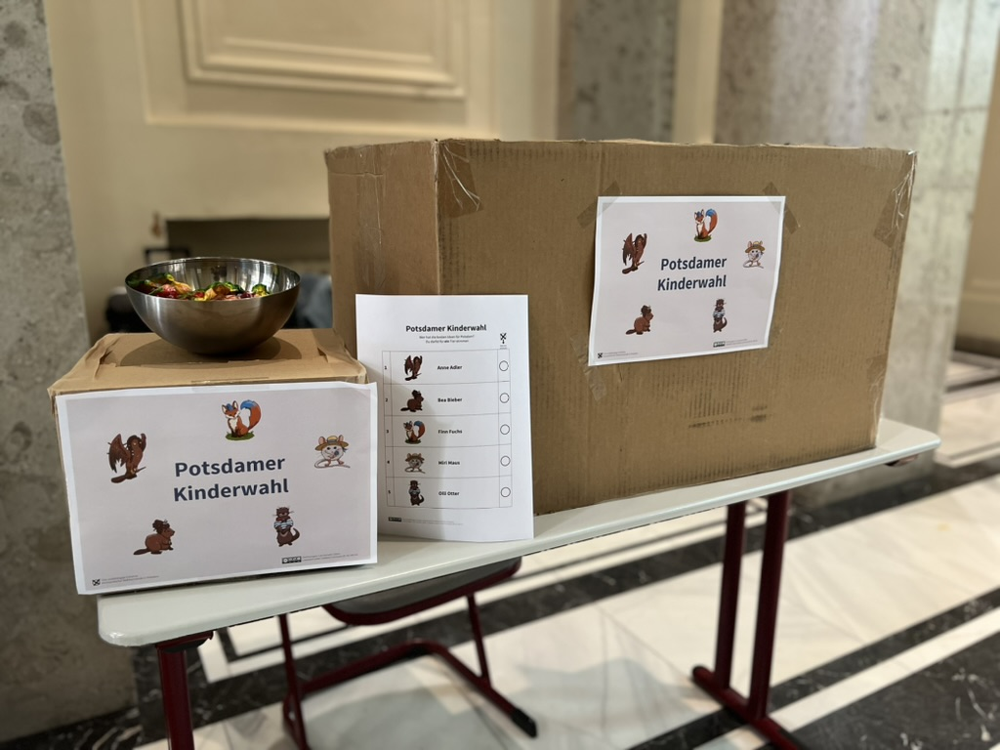

# Potsdamer Kinderwahl

Begleitend zur Landtagswahl in Brandenburg Kindern die Möglichkeiten der Mitbestimmung zeigen.

Karte der Wahllokale und Ergebnisse auf [kinderwahl.de](https://kinderwahl.de).

## Worum geht es?

Damit Kinder besser verstehen können worum es bei Wahlen geht **und damit die Eltern sie dafür nicht mit in die Wahlkabine nehmen müssen**, wollen wir eine ergänzende Kinderwahl in teilnehmenden Wahllokalen anbieten.

Anstatt politischer Parteien kandidieren Tiere mit ihren Vorstellungen und Programmen zu einer schönen Stadt. Die Vorstellungen dürfen sich auch widersprechen. So können die Kinder lernen, dass die Tiere an gemeinsamen Lösungen arbeiten müssen.

## Was braucht es um mitzumachen?

Sie brauchen:

* Ausgedruckte A4 **Stimmzettel**: [Farbe](Stimmzettel.pdf) oder [Graustufen](Stimmzettel_SW.pdf)
* Ausgedruckte A4 **Flyer** mit den Wahlprogrammen: [Farbe](Flyer.pdf) oder [farbreduziert](Flyer_keinHG.pdf) oder [Graustufen](Flyer_SW.pdf) 
* Eine **Wahlurne**: Z.B. Schuhkarton oder alte Holzkiste, mit Schlitz im Deckel. 
    * Möglichst keine Produktmarken auf dem Karton zu erkennen
    * Optional: Dekoration [`Schild.pdf`](Schild.pdf)
* Eine **extra Wahlkabine**, möglichst räumlich getrennt von den anderen Kabinen
    * Sie sollte klar mit **Kinderwahl** markiert sein, z.B. [`Schild.pdf`](Schild.pdf) kann angeklebt werden.
    * Es reicht ein aufgeschnittener großer Pappkarton (s. Bild unten)
    * In manchen Wahllokalen werden Zusatzkabinen geliefert. Wenn es die Kapazitäten zulassen, können die verwendet werden. Achten Sie auf räumliche Trennung

Optional:

* Kekse, Bonbons o.Ä. zur "Belohnung" (nur mit Zustimmung der Eltern)
* Telefonbuch, Papierstapel o.Ä. auf dem Stuhl, damit die Kinder bequem sitzen können

Wir empfehlen 50 Stimmzettel pro Wahllokal und 30-40 Flyer mit den Wahlprogrammen (da auch diese gern mitgenommen werden).
Wenn Sie wollen, schreiben Sie gern Ihre Wahlbezirksnummer an `info <ätt> kinderwahl <punkt> de`, dann werden Sie auf der Karte der teilnehmen Wahllokale auf [kinderwahl.de](https://kinderwahl.de) eingetragen.

Die Ergebnisse sollen datensparsam verkündet werden (**bitte keine Kontaktdaten sammeln!**). Eine Ergebniswebseite befindet sich unter [kinderwahl.de](https://kinderwahl.de). Schreiben Sie Ihr Ergebnis und den Wahlbezirk bitte an obere E-Mail.
Sie können in Absprache mit den Verantwortlichen (Hausmeister o.Ä.) im Wahllokal auch unseren [`Ergebniszettel.pdf`](Ergebniszettel.pdf) aufhängen.

## Eindrücke von der Europawahl 2024

*Abgebildet sind: Ein Schuhkarton als Urne, ein paar Stimmzettel und ein aufgefalteter Pappkarton als Kabine. Der Aufbau wirkt bewusst improvisiert um nicht mit der offiziellen Wahl verwechselt zu werden.*

Die Kinder bekamen zuerst einen [Flyer](Flyer.pdf) mit den *Wahlprogrammen* (während dieser Zeit konnte meist ein Elternteil schon wählen). Anschließend wurde die Kabine auf einen Tisch im Flur gestellt um die Wichtigkeit des Wahlgeheimis zu erklären.

Nach Stimmabgabe und Einwurf in die Urne, durften die Kinder aus einer Bonbonschüssel wählen.

Es nahmen 50 bis 60 Kinder in jedem Wahllokal teil.

Aus einer E-Mail eines Elternteils:

> Um unsere Kinder [unter 5 und unter 10 Jahre] schon früh mit der Bedeutung und den Prozessen rund ums "Wählengehen" zu betrauen, nehmen wir sie immer mit ins Wahllokal.
>
> Bei der Wahl am Wochenende waren sie erstaunt und haben sich sehr gefreut, dass es ein Kinderwahlangebot gab und verschiedene Kandidaten (Finn Fuchs, Olli Otter, Miri Maus,...) von einem der Wahlhelfer vorgestellt wurden. Stolz haben sie dann in der Kinderwahlkabine abgestimmt. Diese tolle Idee hat dazu geführt, dass uns unsere Große seehr [sic!] viele Fragen rund ums Wählen gestellt hat.
> 
> Vielen Dank für Ihren Einsatz um die Wahl.

## Weitere Fragen und Antworten

#### Frage: Hat die Stadtverwaltung der Landeshauptstadt Potsdam etwas damit zu tun?

Antwort: Nein, die Aktion wird komplett von ehremamtlichen Wahlvorständen (vulgo: Wahlhelferinnen und Wahlhelfern) organisiert.

#### Frage: Kann ich Materialgeld, z.B. zum Drucken, haben?

Antwort: Leider nein. Wir erhalten keine Förderung für dieses Projekt. Wie auch oft Kekse und Blumen in Wahllokalen, sind das alles ehrenamtliche Beiträge der Wahlvorstände.

#### Frage: Wo finde ich die Ergebnisse?

Antwort: Die Ergebnisse werden in den Tagen nach der Wahl auf [kinderwahl.de](https://kinderwahl.de) veröffentlicht.

#### Frage: Ich war in einem Wahllokal, das nicht in der Liste steht.

Antwort: Wir haben ein paar Stimmzettel unter den Wahlvorständen geteilt. Im Zweifel kurz eine E-Mail, wenn möglich mit einem Kontakt ins Wahlbüro, sodass wir die Ergebnisse einbinden können.

#### Frage: Wer hat diese unglaublich süßen Tiere gemalt?

Antwort: Das war die großartige Lea Gerneth [(Instagram)](https://www.instagram.com/lea_und_schaf/).

#### Frage: Kann ich das Projekt in meiner Stadt wiederholen?

Antwort: Sehr gern. Die Quelldateien finden sich im Ordner [`vorlagen`](vorlagen/). Die Texte können entsprechend angepasst und ausgetauscht werden. Die Künstlerin bittet für die Zeichnungen die [Creative Commons BY-NC-ND 4.0 Lizenz](https://creativecommons.org/licenses/by-nc-nd/4.0/deed.de) zu beachten.

#### Weitere Fragen?

Schreiben an: `info <ätt> kinderwahl <punkt> de`.
