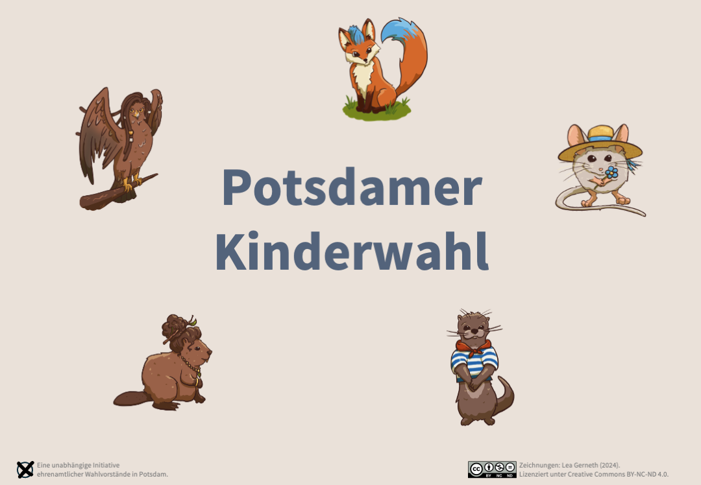

# Potsdamer Kinderwahl

Begleitend zur Kommunal- und Europawahl 2024 Kindern die Möglichkeiten der Mitbestimmung zeigen.

## Worum geht es?

Damit Kinder besser verstehen können worum es bei Wahlen geht **und damit die Eltern sie dafür nicht mit in die Wahlkabine nehmen müssen** wollen wir eine ergänzende Kinderwahl in teilnehmenden Wahllokalen anbieten.

Anstatt politischer Parteien kandidieren Tiere mit ihren Vorstellungen und Programmen zu einer schönen Stadt. Die Vorstellungen dürfen sich auch widersprechen. So können die Kinder lernen, dass die Tiere an gemeinsamen Lösungen arbeiten müssen.

## Was braucht es um mitzumachen?

* Ausgedruckte A4 **Stimmzettel**: [Farbe](Stimmzettel.pdf) oder [SW](Stimmzettel_SW.pdf)
* Ausgedruckte A4 **Flyer** mit den Wahlprogrammen: [Farbe](Flyer.pdf) oder [BW](Flyer_SW.pdf)
* Eine **Wahlurne**: Z.b. Schuhkarton oder alte Holzkiste, mit Schlitz im Deckel. 
    * Möglichst keine Produktmarken auf dem Karton zu erkennen
    * Optional: Dekoration [`Schild.pdf`](Schild.pdf)
* Eine **extra Wahlkabine**, möglichst räumlich getrennt von den anderen Kabinen
    * Sie sollte klar mit **Kinderwahl** markiert sein, z.B. [`Schild.pdf`](Schild.pdf) kann aufliegen.
    * Es reicht ein aufgeschnittener großer Pappkarton
    * In manchen Wahllokalen werden Zusatzkabinen geliefert. Wenn es die Kapazitäten zulassen, können die verwendet werden.

Optional:

* Kekse, Bonbons o.Ä. zur "Belohnung" (nur auf Zustimmung der Eltern)
* Telefonbuch, Papierstapel o.Ä. auf dem Stuhl, damit die bequem Kinder sitzen

Die Ergebnisse sollen datensparsam verkündet werden (**bitte keine Kontaktdaten sammeln!**). Vorschlag: Bsp. in der Woche nach der Wahl am Lokal aushängen (mit den Ansprechpartnern vor Ort abstimmen), s. [`Ergebniszettel.pdf`](Ergebniszettel.pdf).

## Fragen und Antworten

#### Frage: Hat die Stadtverwaltung der Landeshauptstadt Potsdam etwas damit zu tun?

Antwort: Nein, die Aktion wird komplett von ehremamtlichen Wahlvorständen (vulgo: Wahlhelferinnen und Wahlhelfern) organisiert.

#### Frage: Kann ich Materialgeld, z.B. zum Drucken, haben?

Antwort: Leider nein. Wir erhalten keine Förderung für dieses Projekt. Wie auch oft Kekse und Blumen in Wahllokalen, sind das alles ehrenamtliche Beiträge der Wahlvorstände.

#### Frage: Kann ich das Projekt in meiner Stadt wiederholen?

Antwort: Sehr gern. Die Quelldateien folgen bald. Die Texte können entsprechend angepasst und ausgetauscht werden. Die Künstlerin bittet für die Zeichnungen die [Creative Commons BY-NC-ND 4.0 Lizenz](https://creativecommons.org/licenses/by-nc-nd/4.0/deed.de) zu beachten.

#### Weitere Fragen?

Schreiben an: `kinderwahl <ätt> svenkoehler <punkt> de`.
